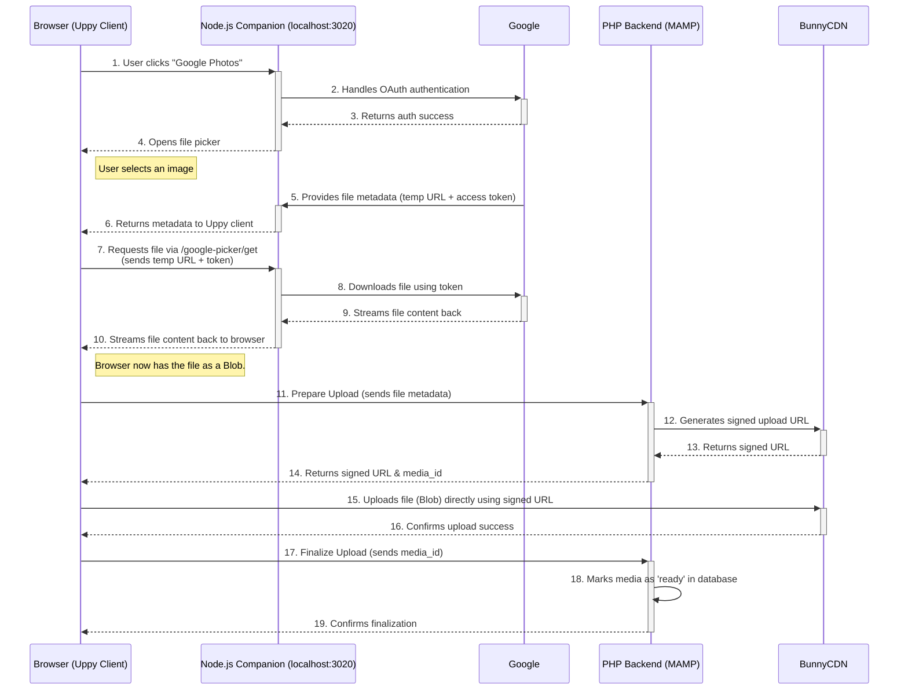

# Local Development & Integration

**Yes, you can run the Node.js Companion app locally alongside your MAMP setup.**

The two apps do not need to be on the same server because the browser acts as the intermediary.

-   **PHP App (Media Library):** Runs on MAMP (e.g., `http://media-library.test`). It serves the frontend Uppy client to the browser.
-   **Node.js App (Companion):** Runs on Node.js (e.g., `http://localhost:3020`). It handles OAuth and file transfers from remote sources like Google Drive.

### How It Works

1.  Your **PHP app** serves the webpage containing the Uppy uploader.
2.  The Uppy client in the **browser** is configured with a `companionUrl` pointing to your local **Node.js Companion** (`http://localhost:3020`).
3.  Companion handles the secure connection to the remote service (e.g., Google Drive) and streams the file back to the Uppy client in the browser.
4.  The Uppy client then proceeds with its normal upload process to your PHP backend or directly to Bunny CDN.

---

## Detailed Integration Workflow

The current integration uses the companion to fetch files from remote sources (like Google Photos), which are then routed through the browser to be uploaded to the final destination (Bunny CDN).

### Architecture Diagram

### Step-by-Step Explanation

1.  **Initiation & Authentication**: The user clicks the "Google Photos" button in the Uppy dashboard. The Uppy client, configured with the `companionUrl`, redirects to the Node.js companion. The companion handles the entire OAuth 2.0 flow with Google securely.
2.  **File Selection**: Once authenticated, the user sees the Google Photos picker and selects one or more images.
3.  **Metadata Transfer**: Google provides the Companion with temporary, secure metadata for the selected files, including a short-lived download URL and an access token. The Companion passes this information back to the Uppy client in the browser.
4.  **Client-Side Fetch via Companion**: The custom JavaScript in `media-uploader.js` immediately intercepts this. It makes a `fetch` request from the browser to the companion's custom `/google-picker/get` endpoint, passing the temporary URL and token.
5.  **Companion as Fetcher**: The companion server receives this request, downloads the file from the Google Photos URL, and streams the binary data back to the browser as the response to its `fetch` request.
6.  **Blob Creation**: The browser receives the data and creates a `Blob`, which is a file-like object in the browser's memory. At this point, the remote file is treated just like a file the user had selected from their local disk.
7.  **Standard Upload Process**: The Uppy client initiates its standard upload flow.
    -   It first contacts the **PHP Backend** (`prepare_upload`) to create a database entry and get a unique, signed upload URL from **Bunny CDN**.
    -   The browser then uploads the `Blob` directly to the signed Bunny CDN URL.
    -   Finally, the browser notifies the **PHP Backend** (`finalize_upload`) that the upload is complete, and the backend marks the file as ready in the database.

### Alternative Architecture: Server-to-Server Transfer

Your `uppy-companion/index.js` file also contains a `/remote-upload` endpoint. This endpoint is designed for a more advanced, efficient server-to-server transfer that would avoid routing the file through the browser.

In that workflow:

-   The browser would tell the Companion: "Here is the metadata for a file from Google."
-   The Companion would then perform the entire upload process on the server-side:
    1. Download the file from Google.
    2. Contact the PHP backend for a Bunny upload URL.
    3. Upload the file to Bunny.
    4. Contact the PHP backend to finalize the database record.

This approach is more robust and performant, especially for large files or users with slow internet connections, as the heavy lifting is done between servers. You could implement this by changing your front-end `media-uploader.js` to send remote file metadata to the `/remote-upload` endpoint instead of fetching the blob to the client.
